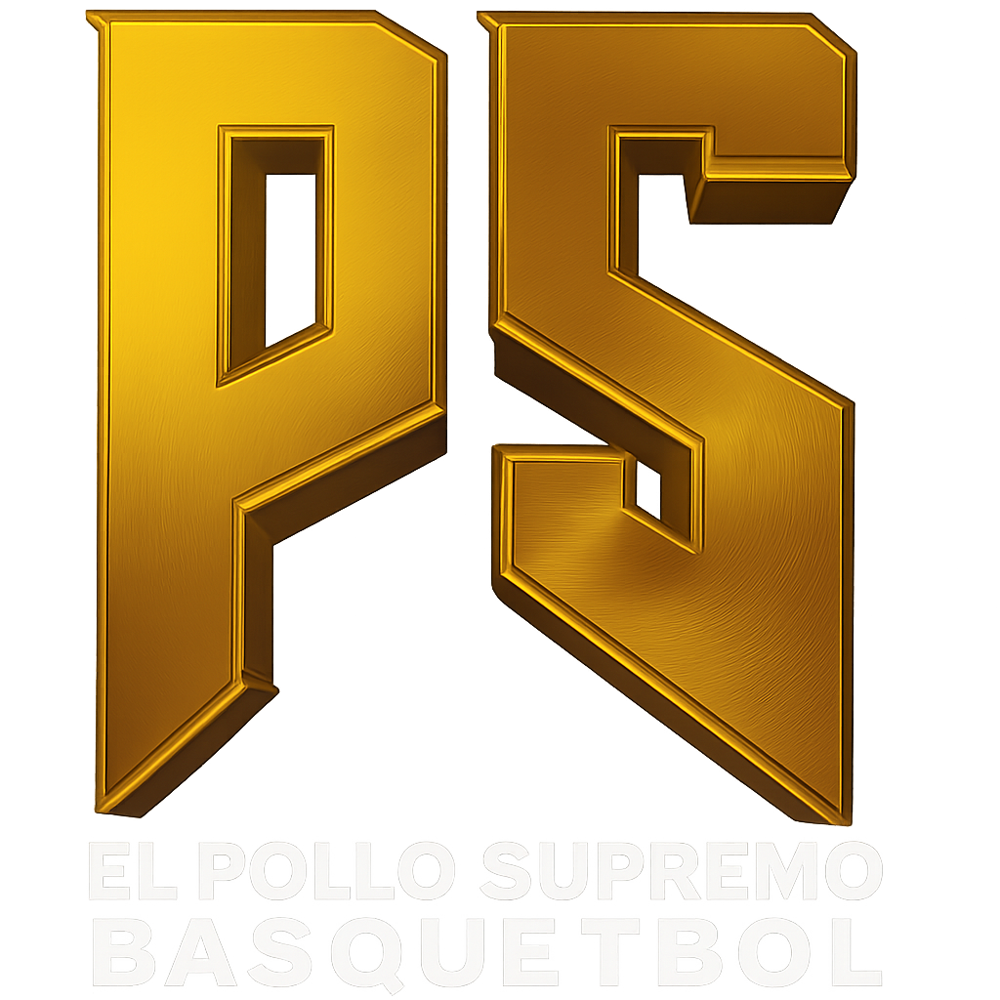

# Sitio Web de El Pollo Supremo 🏀

<div align="center">
  
</div>

<p align="center">
  <strong>La plataforma de medios oficial para el narrador de básquetbol oaxaqueño "El Pollo Supremo".</strong>
  <br />
  Un sitio web dinámico construido con un stack moderno para mostrar torneos, videos, patrocinadores y más.
</p>

<p align="center">
  
  
  
  
  
</p>

---

## 🚀 Descripción del Proyecto

Este proyecto es el sitio web oficial de "El Pollo Supremo", una popular marca de transmisiones de básquetbol en Oaxaca, México. La plataforma sirve como un centro de operaciones digital para centralizar todo el contenido, incluyendo:
* Un calendario y archivo de torneos.
* Una videoteca de partidos completos y jugadas destacadas.
* Una sección para patrocinadores.
* Una tienda en línea (maqueta) para venta de mercancía.

Todo el contenido es gestionado a través de un **Headless CMS (Strapi)**, permitiendo al cliente final actualizar el sitio en tiempo real sin necesidad de tocar el código.

## 🛠️ Tecnologías Utilizadas

- **Frontend:**
  - **Framework:** Next.js (App Router)
  - **Lenguaje:** TypeScript
  - **Estilos:** Tailwind CSS
  - **Animaciones:** Framer Motion
  - **Carruseles:** Embla Carousel
  - **Íconos:** React Icons
- **Backend (CMS):**
  - **Plataforma:** Strapi (Headless CMS)
  - **Base de Datos (Local):** SQLite

## 📋 Requisitos Previos

Asegúrate de tener instalado el siguiente software en tu máquina:
- **Node.js:** Versión 18.x o superior.
- **npm** o **yarn** como gestor de paquetes.

## ⚙️ Instalación y Ejecución Local

El proyecto está dividido en dos partes: **backend** y **frontend**. Ambas deben estar corriendo simultáneamente.

### Parte 1: Backend (Strapi)

1.  **Navegar a la carpeta del backend:**
    ```bash
    cd el-pollo-supremo-cms
    ```
2.  **Instalar dependencias:**
    ```bash
    npm install
    ```
3.  **Iniciar el servidor de Strapi:**
    ```bash
    npm run develop
    ```
    - 🟢 El backend estará corriendo en `http://localhost:1337`.
    - 🔑 La primera vez, crea tu cuenta de administrador en `http://localhost:1337/admin`.
    - ✍️ Añade contenido (partidos, videos, etc.) para que el frontend pueda mostrarlo.

### Parte 2: Frontend (Next.js)

1.  **Abrir una nueva terminal.**
2.  **Navegar a la carpeta del frontend:**
    ```bash
    cd el-pollo-supremo-web
    ```
3.  **Instalar dependencias:**
    ```bash
    npm install
    ```
4.  **Configurar variables de entorno:**
    - Crea un archivo en la raíz de `el-pollo-supremo-web` llamado `.env.local`.
    - Copia y pega el siguiente contenido, reemplazando con la información real:
      ```env
      NEXT_PUBLIC_STRAPI_URL="http://localhost:1337"
      NEXT_PUBLIC_WHATSAPP_NUMBER="5219511234567"
      ```
5.  **Iniciar el servidor de desarrollo:**
    ```bash
    npm run dev
    ```
    - 🟢 El sitio web estará visible en `http://localhost:3000`.

## ⚡ Resumen para Correr el Proyecto

Para poner en marcha el proyecto, necesitarás dos terminales abiertas:

- **Terminal 1 (Backend):** `cd el-pollo-supremo-cms && npm run develop`
- **Terminal 2 (Frontend):** `cd el-pollo-supremo-web && npm run dev`

Luego, abre `http://localhost:3000` en tu navegador.

---
